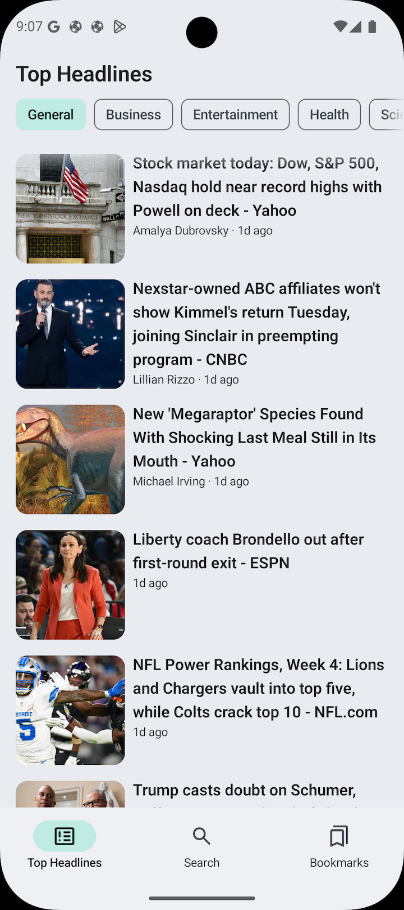

## 📰 News App

Android news application developed in **Kotlin** with **Jetpack Compose**, following the MVVM architecture and Android development best practices.
The application uses the [NewsAPI](https://newsapi.org/) API to display news, allowing you to save articles locally, navigate between categories, and search for news based on a query.

<p>
<a href="README_ES.md">Leer en Español</a>
</p>

## 📱 Features

* **Browse news**: Access to top news by category (general, business, entertainment, health, science, sports, technology).
* **Search**: Find news by keyword.
* **Bookmark**: Save articles in the local database.
* **History**: View recent searches.
* **Offline mode**: Access saved articles without a connection.
* **Dynamic UI**: Animations and transitions with Jetpack Compose (Shared element transition).

## 📚 Table of Contents

- [Tech Stack & Architecture](#-tech-stack--architecture)
- [Screenshots](#-screenshots)
- [Installation and Run](#-installation-and-run)
- [Contact](#-contact)

## 🛠️ Tech Stack & Architecture

The project follows an **MVVM (Model - View - ViewModel)** architecture, separating responsibilities into different layers to improve code scalability, testability, and maintainability.

### Tech Stack

| Component | Technology                                                                                                              |
| :--- |:------------------------------------------------------------------------------------------------------------------------|
| **UI** | Jetpack Compose                                                                                                         |
| **Architecture** | MVVM & Clean Architecture                                                                                               |
| **Dependency Injection** | Hilt                                                                                                                    |
| **Networking** | Retrofit                                                                                                                |
| **Local Storage** | Room                                                                                                                    |
| **Pagination** | Paging 3 (`PagingSource` & `RemoteMediator`)                                                                            |
| **Image Loading** | Coil                                                                                                                    |
| **Navigation** | Compose Navigation                                           |

### Architecture Diagram

The app is structured into three main layers: **Data**, **Domain**, and **UI**.


```
.
├── data
│   ├── local
│   │   ├── dao
│   │   ├── entity
│   │   └── relation
│   ├── paging
│   ├── remote
│   │   └── response
│   └── repository
│
├── domain
│   ├── model
│   ├── repository
│   └── usecases
│
├── ui
│   ├── core
│   │   ├── components
│   │   ├── mappers
│   │   └── navigation
│   ├── screens
│   └── theme
```

* **Data**: Contains data access logic.
  * `local`: Room database (`dao`, `entity`, `relation`).
  * `remote`: API consumption with Retrofit (`response`).
  * `paging`: Paging logic with Paging 3.
  * `repository`: Repository implementations that bridge `local` and `remote`.
* **Domain**: Defines business rules and domain models.
  * `model`: Models used by the domain layer.
  * `repository`: Interfaces that define contracts for data access.
  * `usecases`: Use cases that encapsulate business logic.
* **UI**: Interface with Jetpack Compose.
  * `core`:
    * `components`: Reusable UI components.
    * `navigation`: Navigation handling with Compose.
  * `screens`: Each screen of the application.
  * `theme`: Definitions of colors, typography, and styles.

## 📸 Screenshots

| Top Headlines | More Headlines | Article Details |
| :---: | :---: | :---: |
|  |  |  |
| **Search Results** | **Recent Searches** | **Bookmarks (Empty)** |
|  |  |  |
| **Bookmarked Articles** | **Swipe to Delete** | **After Deleting** |
|  |  |  |

## ⚙️ Installation and Run

1.  **Clone this repository.**
2.  Open the project on **Android Studio**.
3.  Set your [NewsAPI](https://newsapi.org/) API key:
  * Get an API key from the official website.
  * Add it to your `local.properties` file:
      ```properties
      NEWS_API_KEY="your_api_key_here"
      ```
4.  **Sync the project and run** it on an Android device/emulator.

## 📞 Contact

**Daniel Frías** - [danielfb2312@gmail.com](mailto:danielfb2312@gmail.com) - [LinkedIn Profile](https://www.linkedin.com/in/daniel-frias-balbuena/)

