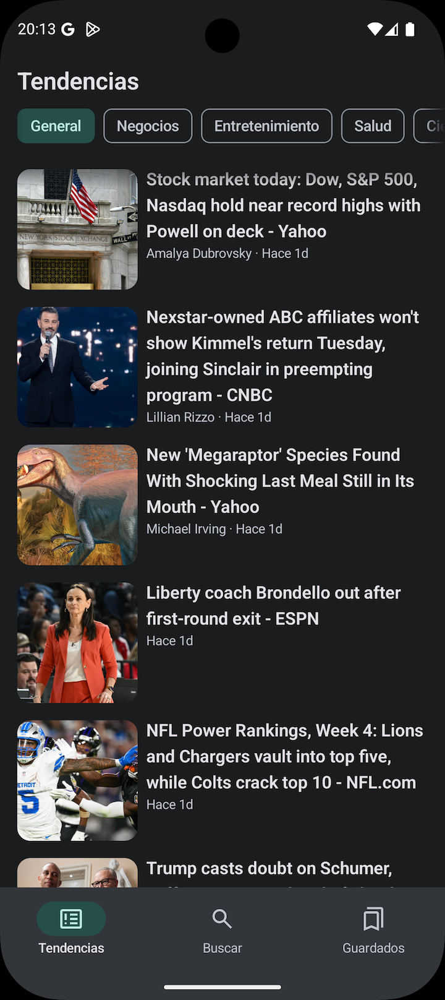
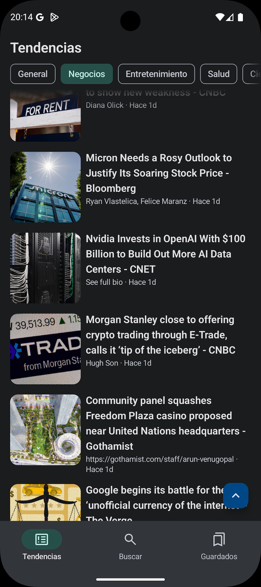
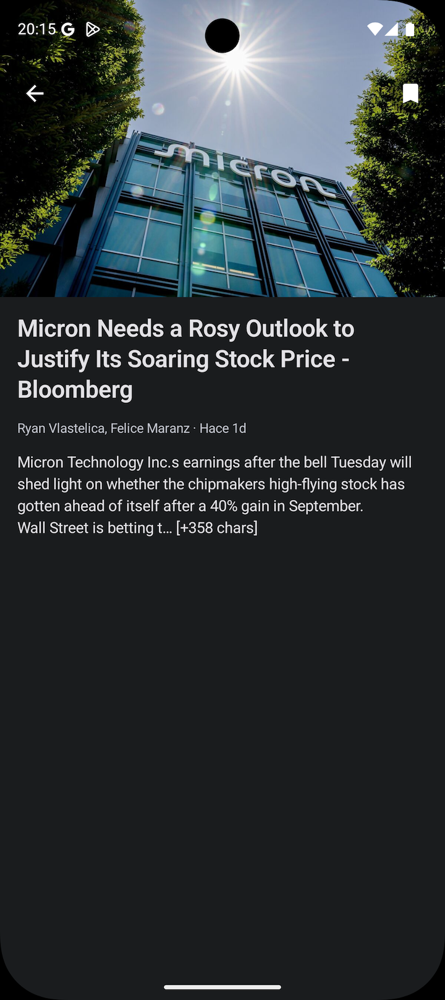
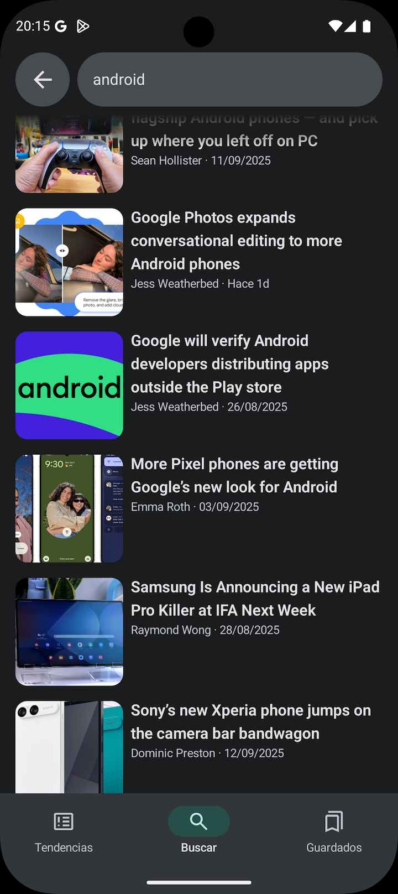
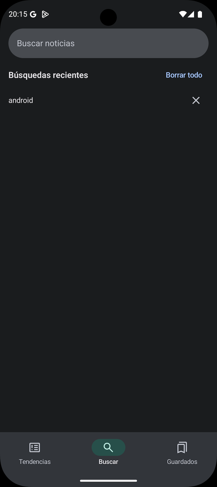
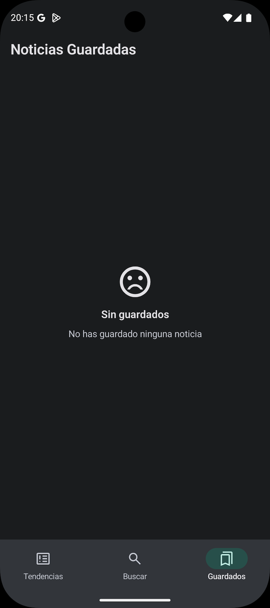
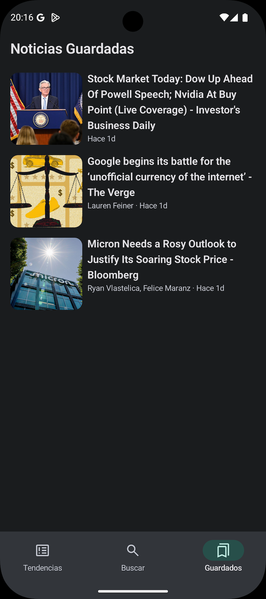
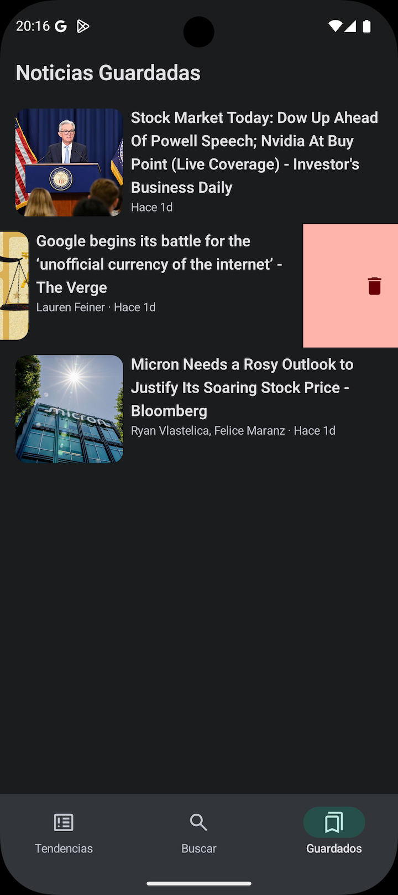
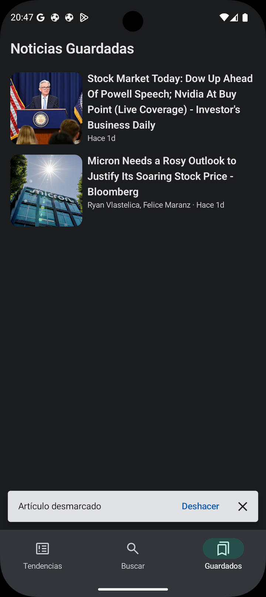

## 📰 Aplicación de Noticias

Aplicación Android de noticias desarrollada en **Kotlin** con **Jetpack Compose**, siguiendo la arquitectura MVVM y buenas prácticas de desarrollo Android.
La aplicación consume la API de [NewsAPI](https://newsapi.org/) para mostrar las noticias, permitiendo guardar artículos localmente, navegar entre categorías y buscar noticias según una consulta.

## 📱 Funcionalidades

* **Explorar noticias**: Acceso a noticias destacadas por categoría (general, negocio, entretenimiento, salud, ciencia, deportes, tecnología).
* **Búsqueda**: Encuentra noticias por palabra clave.
* **Favoritos**: Guarda artículos en la base de datos local.
* **Historial**: Consulta búsquedas recientes.
* **Modo offline**: Accede a artículos guardados sin conexión.
* **UI dinámica**: Animaciones y transiciones con Jetpack Compose (Transición de elementos compartidos).

## 📚 Tabla de Contenidos

- [Stack Tecnológico y Arquitectura](#-stack-tecnológico-y-arquitectura)
- [Capturas de Pantalla](#-capturas-de-pantalla)
- [Instalación y Ejecución](#-instalación-y-ejecución)
- [Contacto](#-contacto)

## 🛠️ Stack Tecnológico y Arquitectura

El proyecto sigue una arquitectura **MVVM (Model - View - ViewModel)**, separando las responsabilidades en diferentes capas para mejorar la escalabilidad, testabilidad y mantenimiento del código.

| Componente                       | Tecnología                                   |
|:---------------------------------|:---------------------------------------------|
| **UI**                           | Jetpack Compose                              |
| **Arquitectura**                 | MVVM & Clean Architecture                    |
| **Inyección de dependencias**    | Hilt                                         |
| **Peticiones HTTP**              | Retrofit                                     |
| **Almacenamiento local**         | Room                                         |
| **Paginación**                   | Paging 3 (`PagingSource` & `RemoteMediator`) |
| **Carga de imágenes asíncronas** | Coil                                         |
| **Navegación**                   | Compose Navigation                           |

### Diagrama de Arquitectura

La app está estructurada en tres capas principales: **Data**, **Domain** y **UI**.

```
.
├── data
│   ├── local
│   │   ├── dao
│   │   ├── entity
│   │   └── relation
│   ├── paging
│   ├── remote
│   │   └── response
│   └── repository
│
├── domain
│   ├── model
│   ├── repository
│   └── usecases
│
├── ui
│   ├── core
│   │   ├── components
│   │   ├── mappers
│   │   └── navigation
│   ├── screens
│   └── theme
```

* **Data**: Contiene la lógica de acceso a datos.
    * `local`: Base de datos Room (`dao`, `entity`, `relation`).
    * `remote`: Consumo de la API con Retrofit (`response`).
    * `paging`: Lógica de paginación con Paging 3.
    * `repository`: Implementaciones de los repositorios que unen `local` y `remote`.
* **Domain**: Define las reglas de negocio y modelos de dominio.
    * `model`: Modelos que usa la capa de dominio.
    * `repository`: Interfaces que definen contratos para acceder a los datos.
    * `usecases`: Casos de uso que encapsulan la lógica de negocio.
* **UI**: Interfaz con Jetpack Compose.
    * `core`:
        * `components`: Componentes reutilizables de la UI.
        * `navigation`: Manejo de la navegación con Compose.
    * `screens`: Cada pantalla de la aplicación.
    * `theme`: Definiciones de colores, tipografías y estilos.

## 📸 Capturas de Pantalla

|                                          Tendencias                                          |                                           Más Tendencias                                            |                                                       Detalles                                                       |
|:--------------------------------------------------------------------------------------------:|:---------------------------------------------------------------------------------------------------:|:--------------------------------------------------------------------------------------------------------------------:|
|  |         |                                      |
|                                         **Búsqueda**                                         |                                       **Búsquedas recientes**                                       |                                                **Guardados (Vacío)**                                                 |
|       |    |                      |
|                                   **Artículos Guardados**                                    |                                     **Deslizar para eliminar**                                      |                                               **Después de Eliminar**                                                |
|            |  |  |


## ⚙️ Instalación y Ejecución

1. **Clona este repositorio.**
2. Abre el proyecto en **Android Studio**.
3. Configura tu clave de la API de [NewsAPI](https://newsapi.org/):
    * Obtén una API key en la web oficial.
    * Añádela en el archivo `local.properties`:
      ```properties
      NEWS_API_KEY="tu_api_key_aquí"
      ```
4. **Sincroniza el proyecto** y ejecútalo en un dispositivo/emulador Android.

## 📞 Contacto

**Daniel Frías** - [danielfb2312@gmail.com](mailto:danielfb2312@gmail.com) - [LinkedIn Profile](https://www.linkedin.com/in/daniel-frias-balbuena/)

